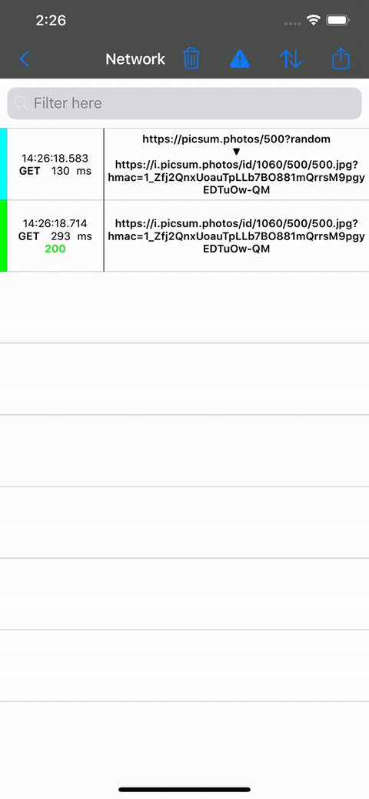

# FNMNetworkMonitor

[]()
[]()
[]()

## What is this ?

FNMNetworkMonitor is an iOS networking framework that can be used to monitor the network of an iOS app. 
It makes **debugging** the network easy, allowing you to pinpoint the root cause of network related problems in your app and share those requests via email. 
it can also **mock** network requests, making it much easier to use incomplete APIs or model specific states for unit testing.

Supports Swift 5 and is bridged for ObjC compatibility.


## Installation ⚙️

1. Add `pod 'FNMNetworkMonitor'` to your `Podfile`

## Usage

### There are a few ways to monitor the network:

1. Monitoring URLSession.shared:

```swift    
FNMNetworkMonitor.registerToLoadingSystem()
FNMNetworkMonitor.shared.startMonitoring(passiveExport: false)
```
    
2. Monitoring custom URLSessions by supplying the FNMMonitor URL Protocol:

```swift    
let sessionConfig = URLSessionConfiguration.ephemeral
sessionConfig.protocolClasses = FNMNetworkMonitor.normalizedURLProtocols()
self.customSession = URLSession(configuration: sessionConfig)
FNMNetworkMonitor.shared.startMonitoring(passiveExport: false)
```

3. You can also take advantage of sizzling the URLSessionConfiguration creation to configure the URL Protocol to all sessions, allowing to monitor 3rd party SDKs too.

### Additionally, you can mock certain requests using:

```swift    
let request = FNMProfileRequest(urlPattern: .dynamicPattern(expression: "*farfetch.*robots"))
let profiles = [FNMProfile(request: request,
                           responses: [request.response(statusCode: 200,
                                            headers: [ "Content-Type": "application/json" ],
                                            responseHolder: .keyValue(value: [ "FieldA": 1 ])
                                            delay: 0.25)])]
FNMNetworkMonitor.shared.configure(profiles: profiles)
FNMNetworkMonitor.shared.startMonitoring(passiveExport: false)
```

Make sure to follow steps 1, 2 or 3, depending on the URLSession that runs that particular request.

### How to see it all

A debug UI exists that can be used for easy inspection and export of the network:

```swift    
FNMNetworkMonitor.shared.showDebugListingViewController(presentingNavigationController: self.navigationController)
```

Also, different log levels can be applied to see how the requests are navigating through the monitor:
```swift    
FNMNetworkMonitor.shared.logScope = [.export, .profile, .urlProtocol]
```

Finally, you can turn on the passive export and the requests will be exported to a json file inside a folder found the Documents application folder.

```swift    
FNMNetworkMonitor.shared.startMonitoring(passiveExport: true)
```

### Sample app

The project contains a sample app where you can test the tool.

## Contributing

Read the [Contributing guidelines](CONTRIBUTING.md)

### Disclaimer

By sending us your contributions, you are agreeing that your contribution is made subject to the terms of our [Contributor Ownership Statement](https://github.com/Farfetch/.github/blob/master/COS.md)

## Maintainers

List of [Maintainers](MAINTAINERS.md)


## License

[MIT](LICENSE)

